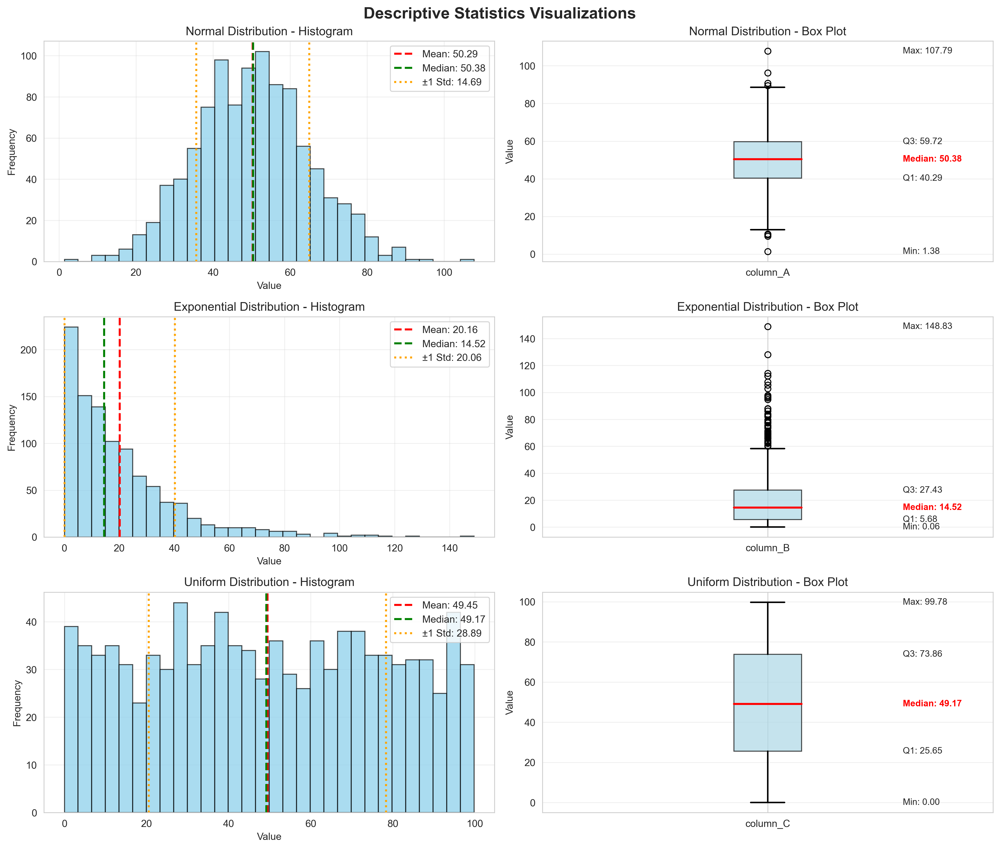
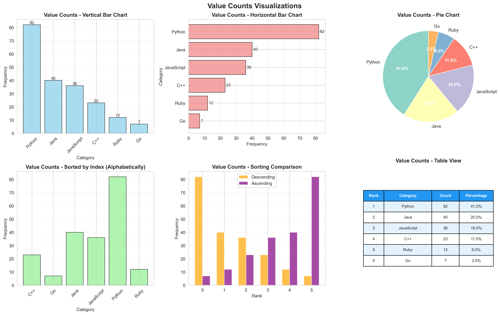
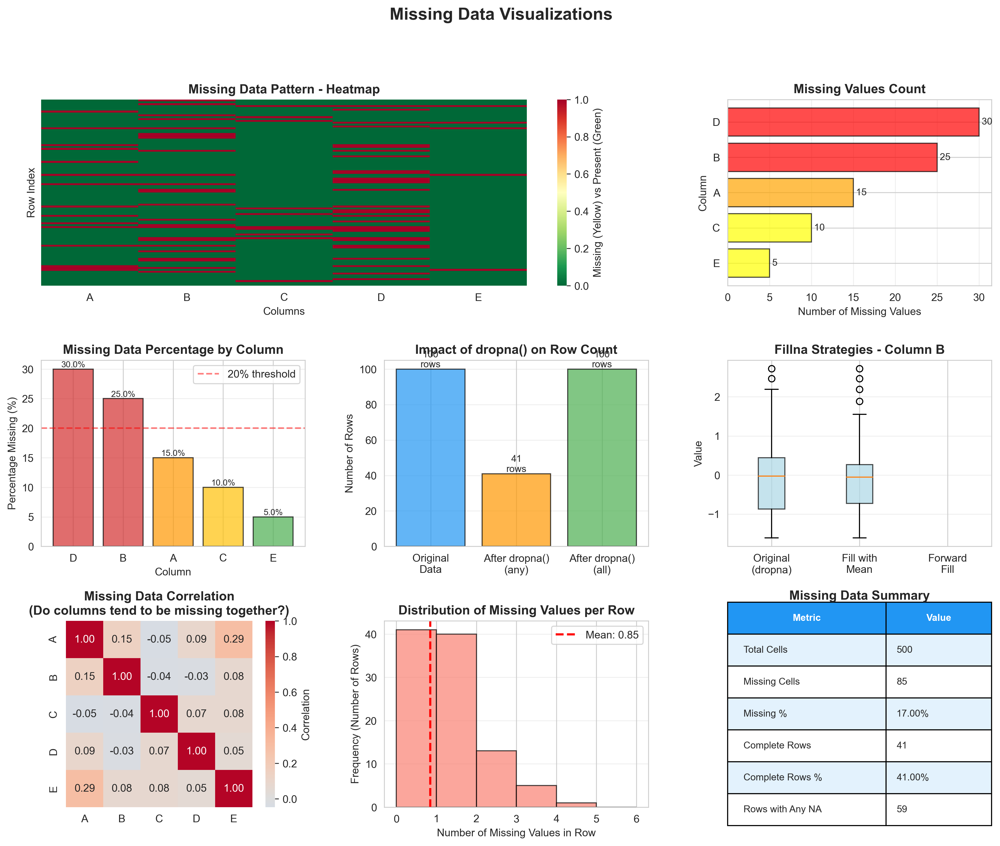
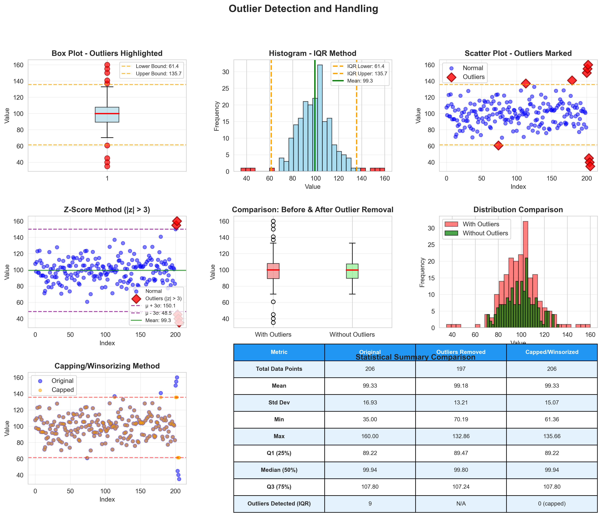
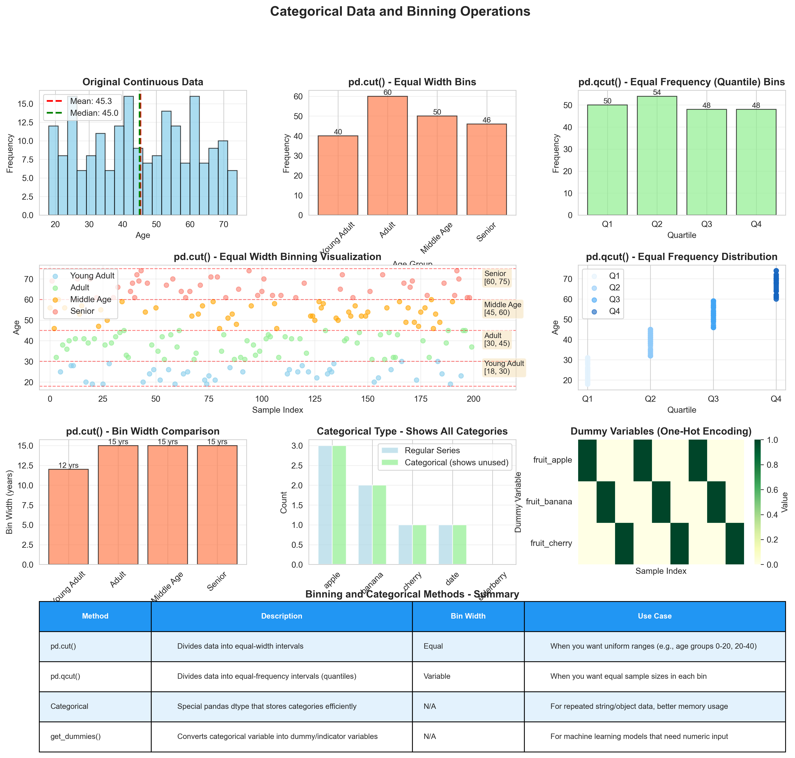
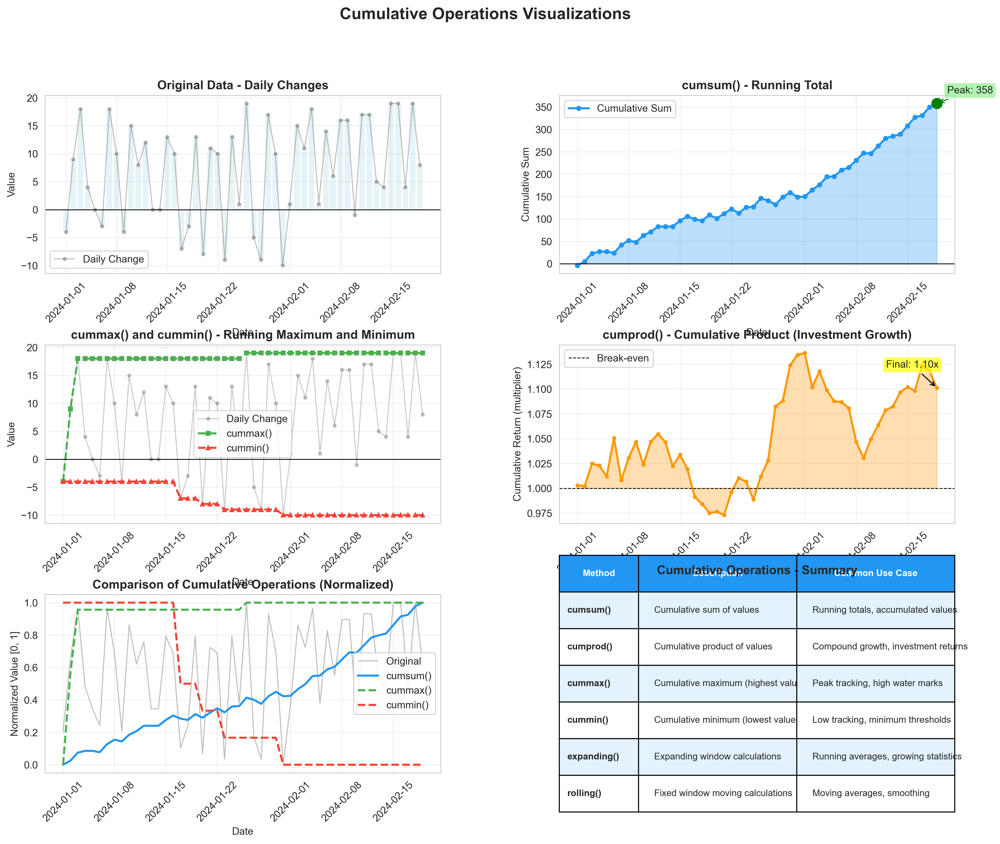

# EDA Basic Lesson - Visual Illustrations

This folder contains visual illustrations for the concepts covered in `eda_basic_lesson.ipynb`.

Since the main notebook focuses on pandas fundamentals without introducing visualization libraries (matplotlib/seaborn), these illustrations are provided separately to help instructors teach the concepts more effectively.

## Available Illustrations

### 1. Descriptive Statistics

- **Concepts**: `describe()`, `mean()`, `std()`, quartiles, min/max
- **Visualizations**:
  - Histograms with mean and standard deviation lines
  - Box plots showing quartiles and outliers
  - Summary statistics table
- **Use case**: Show students how numerical summaries relate to actual data distributions

### 2. Value Counts

- **Concepts**: `value_counts()`, `unique()`, frequency distributions
- **Visualizations**:
  - Vertical and horizontal bar charts
  - Pie charts for proportions
  - Sorting by frequency vs. alphabetically
  - Tabular comparison
- **Use case**: Demonstrate categorical data frequency analysis

### 3. Missing Data

- **Concepts**: `isna()`, `dropna()`, `fillna()`, missing data patterns
- **Visualizations**:
  - Heatmap showing missing data patterns across DataFrame
  - Bar charts of missing counts and percentages
  - Impact of `dropna()` with different parameters
  - Comparison of `fillna()` strategies (mean, forward fill)
  - Missing data correlation matrix
- **Use case**: Help students identify and understand missing data patterns and handling strategies

### 4. Outlier Detection

- **Concepts**: IQR method, Z-score method, outlier removal, capping/winsorizing
- **Visualizations**:
  - Box plots with outliers highlighted
  - Histograms with outlier boundaries
  - Scatter plots marking outliers
  - Z-score method visualization
  - Before/after comparison
  - Statistical summary comparison
- **Use case**: Teach different outlier detection methods and their impacts

### 5. Categorical Data & Binning

- **Concepts**: `pd.cut()`, `pd.qcut()`, categorical dtype, `get_dummies()`
- **Visualizations**:
  - Original continuous data distribution
  - Equal-width binning (`pd.cut()`)
  - Equal-frequency binning (`pd.qcut()`)
  - Visual bin boundaries
  - Bin width comparison
  - One-hot encoding (dummy variables)
  - Comparison table
- **Use case**: Show the difference between cut() and qcut() and categorical operations

### 6. Duplicates

- **Concepts**: `duplicated()`, `drop_duplicates()`, `keep` parameter
- **Visualizations**:
  - Dataset size before/after duplicate removal
  - Proportion of duplicates
  - Duplicates by column subsets
  - Distribution across categories
  - `keep` parameter comparison ('first', 'last', False)
  - Example table showing keep behavior
- **Use case**: Demonstrate how duplicates affect data and different removal strategies

### 7. Cumulative Operations

- **Concepts**: `cumsum()`, `cumprod()`, `cummax()`, `cummin()`
- **Visualizations**:
  - Original data (daily changes)
  - Cumulative sum as running total
  - Cumulative max and min
  - Cumulative product (investment growth example)
  - Normalized comparison of all operations
  - Summary table of methods
- **Use case**: Show how accumulation operations track running calculations

## How to Use These Illustrations

### For Instructors:

1. **During lectures**: Display these visualizations when covering the corresponding topics in the notebook
2. **As handouts**: Print or share these images for students to reference
3. **For assignments**: Ask students to recreate similar visualizations for their own data
4. **For discussions**: Use these as starting points to discuss data patterns and interpretation

### Regenerating Illustrations:

Each illustration has a corresponding Python script that generates it:
- `01_descriptive_statistics.py` → `01_descriptive_statistics.png`
- `02_value_counts.py` → `02_value_counts.png`
- `03_missing_data.py` → `03_missing_data.png`
- etc.

To regenerate any illustration:
```bash
python illustrations/01_descriptive_statistics.py
```

### Required Libraries:

The illustration scripts require:
- pandas
- numpy
- matplotlib
- seaborn

Install with:
```bash
pip install pandas numpy matplotlib seaborn
```

## Mapping to Notebook Sections

| Notebook Section | Illustration File |
|-----------------|-------------------|
| Summarizing and Computing Descriptive Statistics | `01_descriptive_statistics.png` |
| Value Counts, Unique | `02_value_counts.png` |
| Handling Missing Data | `03_missing_data.png` |
| Handling Outliers | `04_outliers.png` |
| Categorical Data, Computing with Categoricals | `05_categorical_binning.png` |
| Handling Duplicates | `06_duplicates.png` |
| Cumulative operations (cumsum, etc.) | `07_cumulative_operations.png` |

## Notes

- These illustrations are **not** part of the main notebook curriculum, which focuses on pandas fundamentals
- Visualization concepts (matplotlib, seaborn) will be covered in a subsequent lesson
- The data in these illustrations is synthetic and generated for demonstration purposes
- All visualizations are saved at 300 DPI for high-quality printing/display
